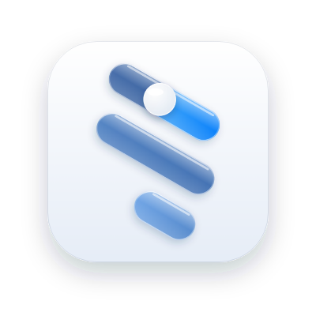

<p align="center">
  <picture>
    <source media="(prefers-color-scheme: dark)" srcset="tool/icons/readme_dark.png">
    
  </picture>
</p>

<h1 align="center">TechPicks</h1>

<p align="center">스펙으로 고르는 전자기기 · iOS · Android · <a href="https://techpicks-mu.vercel.app">웹</a></p>

성능·카메라·화면·배터리·가성비 점수를 내가 정한 비중으로 합친 숫자 하나, TP Index.
카메라가 중요한 사람과 배터리가 중요한 사람은 같은 폰이라도 점수가 다름.

## 화면

- 오늘: 관심 목록 속 지금의 결론, 이번 주 순위 변동
- 둘러보기: 스마트폰 · 프로세서 · 노트북 순위, 조립 견적
- 비교: 두 기기 한 표, 줄마다 이긴 쪽 표시
- 검색: 이름으로 찾기, 종류별 보기
- 상세: 스펙, 다섯 축 점수, 3D 보기
- 질문: 예산이랑 조건 말하면 기기 하나 + 짧은 표 (기기 안 AI 또는 Gemini)
- 내 정보: 가중치, 계정, 설정

로그인은 선택. Apple · Google · 이메일, 로그인하면 관심 목록·가중치·최근 검색이 기기끼리 이어짐.

## 데이터

[TechAPI](https://github.com/GetTechAPI/TechAPI) (CC-BY-SA 4.0). 큐레이션한 기기만 빌드 때 받아서 애셋으로.

```
dart tool/build_catalog.dart      # assets/catalog/v1.json 다시 만들기
dart tool/smoke_techapi.dart      # 원격 확인
```

## 개발

```
flutter pub get
dart run build_runner build --delete-conflicting-outputs
flutter run
flutter analyze && flutter test
```

- iOS 는 iOS 26 리퀴드 글라스, Android 는 Material 3
- Firebase 설정 없어도 실행됨 (로그인만 꺼짐)
- Android Google 로그인: `--dart-define=GOOGLE_SERVER_CLIENT_ID=<id>.apps.googleusercontent.com`
- 규칙 배포: `firebase deploy --only firestore:rules,storage`
- 앱 아이콘: [`tool/icons/README.md`](tool/icons/README.md)
- 웹 사이트: [`site/`](site/README.md) (Next.js, Vercel)

## 라이선스

[Apache 2.0](LICENSE). 기기 데이터는 TechAPI 의 CC-BY-SA 4.0.
